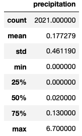
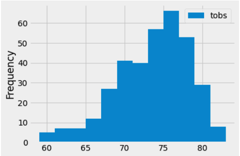
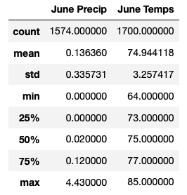
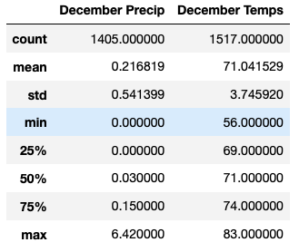

# Surfs_up

## Background

W. Avy likes your analysis, but he wants more information about temperature trends before opening the surf shop. Specifically, he wants temperature data for the months of June and December in Oahu, in order to determine if the surf and ice cream shop business is sustainable year-round.

## Overview.

An investor is interested in opening a Surf and Shake Shop in Oahu; The investor wants to serve ice cream and surfboards but based on preview experiences, he hesitates about the weather. 

The investor contacted me to work on an SQLite database containing Oahu's weather history. Using several tools and modules, I will deliver the necessary insight to lead the investor to make a final decision.

## Results.

The analysis period is from August 23, 2016 - to August 23, 2017. The results indicate that the probability of rain is 17.7 based on 2021 observations.

The risk of raining and affecting the shop operations is significantly low.

As part of the analysis, we can inform the min, max, and average temperature that will help position the shop opportunities for the ice cream business.
- min = 54F
- max = 85F
- average = 72F

Also, we can determine that from June and December, regardless of year, the results showed are similar:

- The average temperature is around 70F.
- June and December showed similar min/max and average temperatures.
- The temperature does not have dramatic fluctuations throughout the year.

I also analyzed the precipitation performance for June and December.
- June at 13.6%
- December at 21.6%

## Summary.

From the Temperature and Precipitation analysis, we can infer that Surf and Shake would be a good business with low risk.

